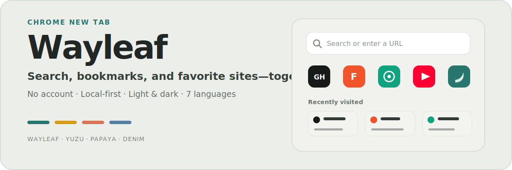

<p align="center">
  
</p>

<p align="center">
  English · <a href="README.md">中文</a> ·
  <a href="https://github.com/je44/wayleaf/releases/latest">Latest release</a> ·
  <a href="https://github.com/je44/wayleaf/releases/download/v1.0/wayleaf-v1.0.1.zip">Download v1.0.1</a> ·
  <a href="PRIVACY.md">Privacy</a>
</p>

Wayleaf is a local-first Chrome new tab extension. It brings search, shortcuts, bookmarks, and most-visited sites onto one page, with a calm interface and no account required.

## See the real interface


<details>
<summary><strong>View dark mode</strong></summary>


</details>

## What you can do

### Start from one search box

- Search by keyword or open a complete URL directly.
- Match local Chrome history and bookmarks in the same box.
- Use Google, Baidu, Bing, or open Google and Bing together.
- Enter prefixes such as `*yt`, `*xhs`, or `*bili` to search supported platforms.

### Organize what you open every day

- Use the built-in site groups or add up to 48 custom sites.
- Add sites from a Chrome bookmark folder without duplicating the same URL.
- Switch folders, search, sort, refresh, or remove bookmarks in the bookmark center.
- Organize most-visited sites from local history while keeping one primary entry per site.

### Keep your own browsing habits

- Follow the system theme or stay in light or dark mode.
- Switch between the low-chroma Wayleaf, Yuzu, Papaya, and Denim palettes.
- Use Chinese, English, Japanese, Korean, Spanish, French, or German.
- Sync manually or once per day, and import or export settings.

## Start in 5 steps

Current version: `1.0.1`

1. Download and unzip [wayleaf-v1.0.1.zip](https://github.com/je44/wayleaf/releases/download/v1.0/wayleaf-v1.0.1.zip).
2. Open `chrome://extensions/`.
3. Turn on Developer mode.
4. Click Load unpacked.
5. Select the unzipped folder that contains `manifest.json`.

> Chrome cannot load the ZIP file directly. Unzip it first.

## Common input

| Input or action | Result |
| --- | --- |
| Keyword + Enter | Search with the current engine |
| Complete URL + Enter | Open the URL directly |
| `*platform prefix` | Switch to the matching platform search |
| `/gpt`, `/claude`, or another command | Open the matching AI site and try to fill the prompt |
| Local search result | Open a matching history item or bookmark |

Platform search supports YouTube, X, Xiaohongshu/RedNote, Instagram, Threads, Douyin, Zhihu, Bilibili, and TikTok. Search Settings lists every available prefix.

## Two optional capabilities

### AI page shortcuts

Commands such as `/gpt` and `/claude` open the matching website and try to fill the prompt. Supported services, commands, and URLs are listed in Search Settings. Sign-in, generated content, and data handling are controlled by the selected service.

### Video mini-player

Enable it under Laboratory, click the Wayleaf icon in the Chrome toolbar, choose Video mini-player, then select a playable video on the page. It starts only through this explicit user flow and works on pages that support standard HTML5 video and Picture-in-Picture.

## Privacy and permissions

Wayleaf does not require an account and does not operate a backend. History, bookmarks, settings, and caches stay in the browser extension environment.

| Permission | Purpose |
| --- | --- |
| `bookmarks` | Read the selected bookmark folder and remove bookmarks after a user action |
| `history` | Read local history, rank most-visited sites, and remove history after a user action |
| `favicon` | Display website icons through Chrome |
| `storage` | Save themes, shortcuts, bookmark choices, search settings, and sync state |
| `unlimitedStorage` | Provide space for local icon caches and short-lived page handoff data |
| `alarms` | Run once-daily automatic settings sync |
| `tabs` | Open search results and coordinate video mini-player state |
| `scripting` | Support the video mini-player and optional page handoff helpers |
| `http://*/*`, `https://*/*` | Discover site icons and support relevant features on pages opened by the user |

Network requests occur when:

- A search is sent to the selected search engine or platform.
- An AI page shortcut sends a prompt to the selected service.
- Site icon discovery requests a target site or icon provider.

See [PRIVACY.md](PRIVACY.md) for the full policy.

## Local development

The project uses native HTML, CSS, and JavaScript. It has no dependency installation or build step.

```sh
git clone https://github.com/je44/wayleaf.git
cd wayleaf
```

After editing, reload the Wayleaf card in `chrome://extensions/` and open a new tab.

<details>
<summary><strong>Packaging, checks, and project structure</strong></summary>

Create a loadable directory and release ZIP:

```sh
bash scripts/package-release.sh
```

The outputs are `dist/wayleaf-v1.0.1/` and `dist/wayleaf-v1.0.1.zip`.

Checks to run before committing:

```sh
jq empty manifest.json
node --check background.js
node --check newtab.js
node --check popup.js
node --check ai-submit.js
node --check video-pip.js
node --test scripts/*.test.mjs
```

```text
.
├── manifest.json        # Extension metadata, permissions, and entry points
├── background.js        # Background scheduling
├── newtab.*             # New tab structure, styles, and interaction
├── popup.*              # Chrome toolbar menu
├── ai-submit.js         # Optional page handoff helper
├── video-pip.js         # Video mini-player
├── wayleaf-icon.js      # Site icon handling
├── icons/               # Extension and site icons
└── docs/                # Documentation and previews
```

Before release, run `unzip -t dist/wayleaf-v1.0.1.zip` and confirm that `manifest.json` is at the ZIP root.

</details>

## Troubleshooting

<details>
<summary><strong>The new tab page did not change</strong></summary>

Make sure Wayleaf is enabled and `chrome://extensions/` shows no errors. If another new tab extension is installed, disable it and check again.

</details>

<details>
<summary><strong>The bookmark area is empty</strong></summary>

Choose a folder that contains website bookmarks. A folder with only subfolders and no page URLs does not display any sites.

</details>

<details>
<summary><strong>Settings did not sync to another device</strong></summary>

Make sure both devices use the same Chrome account and Chrome is allowed to sync extension data. If sync is unavailable, settings remain on the current device.

</details>

## Support and license

- Support: [GitHub Issues](https://github.com/je44/wayleaf/issues)
- This repository does not currently include a `LICENSE` file. Confirm permission before reuse or redistribution.
