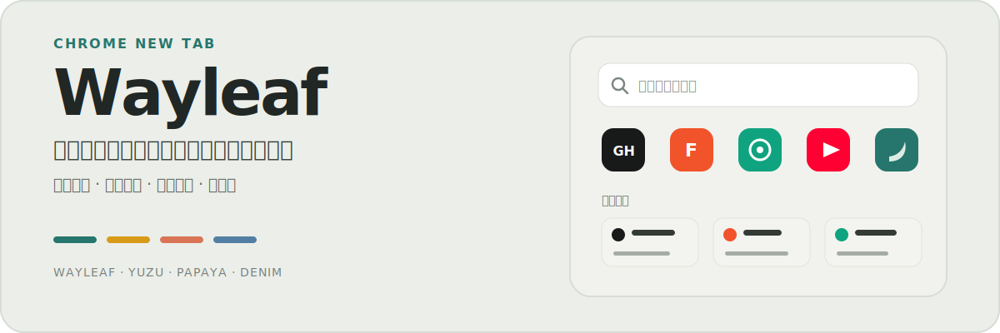

<p align="center">
  
</p>

<p align="center">
  中文 · <a href="README.en.md">English</a> ·
  <a href="https://github.com/je44/wayleaf/releases/latest">最新版本</a> ·
  <a href="https://github.com/je44/wayleaf/releases/download/v1.0/wayleaf-v1.0.1.zip">下载 v1.0.1</a> ·
  <a href="PRIVACY.md">隐私说明</a>
</p>

Wayleaf 是一个本地优先的 Chrome 新标签页扩展。它把搜索、快捷入口、书签和最常访问放在同一页，同时保持界面安静、信息清楚，并且不要求注册账号。

## 先看实际界面


<details>
<summary><strong>查看深色模式</strong></summary>


</details>

## 你可以用它做什么

### 从一个搜索框开始

- 搜索关键词，或直接打开完整网址。
- 同时匹配本机 Chrome 历史记录与书签。
- 使用 Google、百度、Bing，或同时打开 Google 与 Bing。
- 输入 `*yt`、`*xhs`、`*bili` 等前缀，直达平台搜索。

### 整理每天都会打开的内容

- 使用内置网站分类，或添加最多 48 个自定义网站。
- 从 Chrome 书签文件夹加入首页入口，相同网址不会重复添加。
- 在书签中心切换文件夹、搜索、排序、刷新或删除书签。
- 按本机浏览历史整理最常访问网站，并保留每个站点的主要入口。

### 保持自己的使用习惯

- 跟随系统，或固定使用浅色、深色主题。
- 在 Wayleaf、柚黄、木瓜、丹宁四套低饱和配色间切换。
- 使用中文、英文、日文、韩文、西班牙文、法文或德文。
- 手动同步、每日自动同步，或导入和导出设置。

## 5 步开始使用

当前版本：`1.0.1`

1. 下载并解压 [wayleaf-v1.0.1.zip](https://github.com/je44/wayleaf/releases/download/v1.0/wayleaf-v1.0.1.zip)。
2. 打开 `chrome://extensions/`。
3. 开启右上角的「开发者模式」。
4. 点击「加载已解压的扩展程序」。
5. 选择包含 `manifest.json` 的解压目录。

> Chrome 不能直接加载 ZIP 文件，请先解压。

## 常用输入

| 输入或操作 | 结果 |
| --- | --- |
| 关键词 + 回车 | 使用当前搜索引擎搜索 |
| 完整网址 + 回车 | 直接打开网址 |
| `*平台前缀` | 切换到对应平台搜索 |
| `/gpt`、`/claude` 等指令 | 打开对应 AI 网站并尝试填入问题 |
| 本地搜索结果 | 打开匹配的历史记录或书签 |

平台搜索支持 YouTube、X、小红书、Instagram、Threads、抖音、知乎、Bilibili 和 TikTok；完整前缀可在搜索设置中查看。

## 两项按需启用的能力

### AI 页面直达

在搜索框输入 `/gpt`、`/claude` 等指令，可打开对应网站并尝试填入问题。支持的服务、指令和链接可在搜索设置中查看；登录状态、生成内容和数据处理由对应服务负责。

### 视频小窗

在设置中心的「实验室」启用后，点击 Chrome 工具栏里的 Wayleaf 图标，选择「视频小窗」，再选择页面中的可播放视频。它只通过这条明确的用户操作路径启动，并适用于支持标准 HTML5 视频与 Picture-in-Picture 的网页。

## 隐私与权限

Wayleaf 不要求创建账号，也没有自建后端。浏览历史、书签、设置和缓存保存在浏览器扩展环境中。

| 权限 | 用途 |
| --- | --- |
| `bookmarks` | 读取所选书签文件夹，并在用户操作时删除书签 |
| `history` | 读取本机历史、统计最常访问，并在用户操作时删除历史记录 |
| `favicon` | 通过 Chrome 显示网站图标 |
| `storage` | 保存主题、入口、书签选择、搜索设置和同步状态 |
| `unlimitedStorage` | 为本地图标缓存和短期页面交接数据留出空间 |
| `alarms` | 执行每日一次的自动同步 |
| `tabs` | 打开搜索结果，并协调视频小窗状态 |
| `scripting` | 支持视频小窗和可选的页面直达辅助 |
| `http://*/*`、`https://*/*` | 发现网站图标，并在用户打开的网页中支持相关功能 |

发生网络请求的情况：

- 搜索内容发送给用户选择的搜索引擎或平台。
- 使用 AI 页面直达时，问题发送给用户选择的服务。
- 网站图标发现可能请求目标网站或图标服务。

完整说明见 [PRIVACY.md](PRIVACY.md)。

## 本地开发

项目使用原生 HTML、CSS 和 JavaScript，不需要安装依赖，也没有构建步骤。

```sh
git clone https://github.com/je44/wayleaf.git
cd wayleaf
```

修改后，在 `chrome://extensions/` 的 Wayleaf 卡片上点击刷新，再打开新标签页检查。

<details>
<summary><strong>打包、检查与项目结构</strong></summary>

生成可加载目录和发布包：

```sh
bash scripts/package-release.sh
```

输出到 `dist/wayleaf-v1.0.1/` 和 `dist/wayleaf-v1.0.1.zip`。

提交前检查：

```sh
jq empty manifest.json
node --check background.js
node --check newtab.js
node --check popup.js
node --check ai-submit.js
node --check video-pip.js
node --test scripts/*.test.mjs
```

```text
.
├── manifest.json        # 扩展声明、权限和入口
├── background.js        # 后台调度
├── newtab.*             # 新标签页结构、样式和交互
├── popup.*              # Chrome 工具栏菜单
├── ai-submit.js         # 可选页面直达辅助
├── video-pip.js         # 视频小窗
├── wayleaf-icon.js      # 网站图标处理
├── icons/               # 扩展图标和网站图标
└── docs/                # 文档与预览图
```

发布前可运行 `unzip -t dist/wayleaf-v1.0.1.zip`，确认 ZIP 根目录包含 `manifest.json`。

</details>

## 常见问题

<details>
<summary><strong>新标签页没有变化</strong></summary>

确认 Wayleaf 已启用，且 `chrome://extensions/` 没有显示错误。如果安装了多个新标签页扩展，请停用其他同类扩展后再检查。

</details>

<details>
<summary><strong>书签区域为空</strong></summary>

请先选择一个包含网站书签的文件夹。只有子文件夹、没有网页网址的文件夹不会显示内容。

</details>

<details>
<summary><strong>设置没有同步到其他设备</strong></summary>

确认设备使用同一个 Chrome 账号，并允许同步扩展数据。同步不可用时，设置仍会保存在当前设备。

</details>

## 支持与许可

- 问题反馈：[GitHub Issues](https://github.com/je44/wayleaf/issues)
- 当前仓库未包含 `LICENSE` 文件；复用或再分发前请先确认许可。
