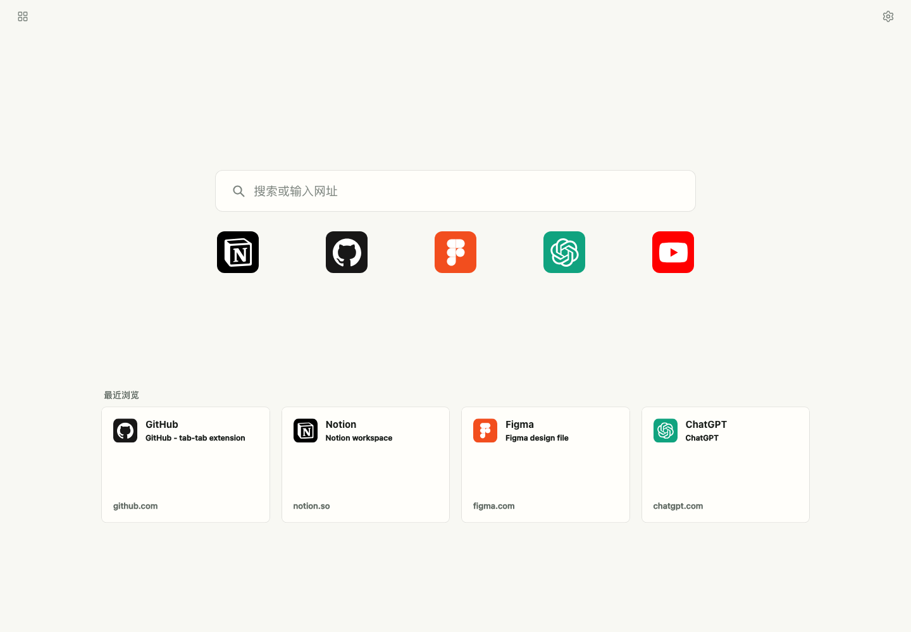
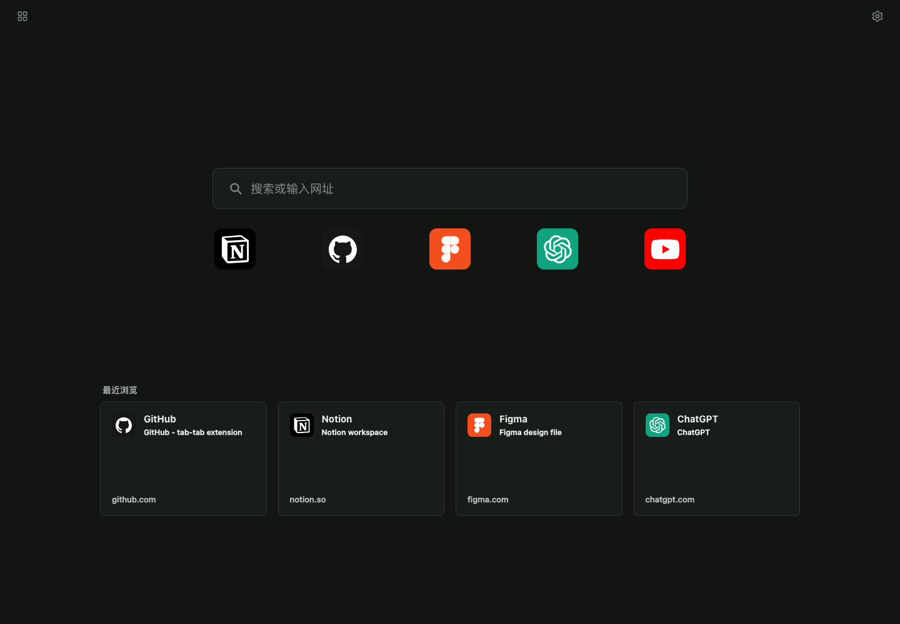

# tab-tab Chrome 扩展

`tab-tab` 是一个本地 Chrome 新标签页扩展，把常用入口、指定书签文件夹、最近浏览和快速搜索整理到一屏。每次打开新标签页，都能直接回到当前要处理的事，而不是重新翻找入口。

## 预览

| 日间模式 | 夜间模式 |
| --- | --- |
|  |  |

## 给使用者

一个新标签页应该像一张干净的桌面：常用的放在眼前，临时要用的留在手边，不常用的收进清楚的位置。`tab-tab` 把浏览器首页整理成可扫视、可切换、可长期维护的入口页。

- **常用入口**：把每天会点开的工具、资料和站点固定在顶部区域。
- **书签工作区**：选择一个 Chrome 书签文件夹，让同一主题的链接自然聚在一起。
- **最近浏览**：按网站整理近期页面，把短期反复使用的页面置顶。
- **快速搜索**：从新标签页直接输入关键词，减少来回切换。
- **设置中心**：统一切换明暗模式，选择喜欢的双色外观，也可以自己调颜色。
- **本地保存**：入口、选择、置顶和主题偏好都保存在浏览器本地，不上传浏览数据。

### 下载

- 最新版本：[GitHub Releases](https://github.com/je44/tab-tab-chrome-extension/releases/latest)
- 当前安装包：[tab-tab-v1.1.0.zip](https://github.com/je44/tab-tab-chrome-extension/releases/download/v1.1/tab-tab-v1.1.0.zip)

### v1.1 更新

这一版把原来的单个明暗切换按钮换成了「设置中心」，主题选择更清楚，也更容易按自己的喜好调整。

- 新增：可选择跟随系统、日间或夜间模式。
- 新增：可在三组默认双色之间切换，也可以自定义日间和夜间的主色。
- 新增：最近浏览的展开列表会显示访问时间，回到刚看过的页面更快。
- 改进：最近浏览的删除更准确，只处理可删除的网页记录。
- 删除：顶部单独的明暗切换按钮，相关功能已合并到设置中心。

### 安装

1. 下载并解压 `tab-tab-v1.1.0.zip`。
2. 打开 Chrome 的 `chrome://extensions/`。
3. 开启「开发者模式」。
4. 点击「加载已解压的扩展程序」，选择解压后的文件夹。
5. 新建标签页，确认页面已切换为 `tab-tab`。

### 权限

- `bookmarks`：读取书签文件夹和书签项。
- `history`：读取最近浏览记录。
- `favicon`：显示网站图标。
- `storage`：保存自定义入口、书签选择、置顶历史、主题和布局偏好。

## 项目说明

这是一个无构建步骤的 Chrome Manifest V3 扩展。`manifest.json` 把新标签页入口指向 `newtab.html`，页面直接加载 `newtab.css` 和 `newtab.js`。整个目录可以直接交给 Chrome 加载，也可以压缩后作为发布包。

### 代码结构

- `manifest.json`：扩展声明、版本号、权限、图标和新标签页入口。
- `newtab.html`：页面结构、三栏区域、搜索栏、弹层和卡片模板。
- `newtab.css`：主题、布局、响应式规则和卡片视觉。
- `newtab.js`：单页运行时，负责 Chrome API 读取、状态保存、渲染和交互。
- `icons/`：扩展图标和默认入口图标。
- `docs/`：图标来源、产品事实和 README 预览图。

### 维护方向

当前保持轻量单页结构，不引入框架或打包工具，方便直接加载、检查和发布。后续如果继续扩展，优先把 `newtab.js` 按 `portals`、`bookmarks`、`history`、`search`、`storage`、`i18n` 拆分；同时保持数据本地化，新增能力前再评估是否需要扩大权限。

### 打包发布

```sh
mkdir -p dist
zip -r -X dist/tab-tab-v1.1.0.zip manifest.json newtab.html newtab.css newtab.js icons
jq empty manifest.json
node --check newtab.js
unzip -t dist/tab-tab-v1.1.0.zip
```

发布包要求 `manifest.json` 位于 zip 根目录，并与 GitHub Release 版本保持一致。
